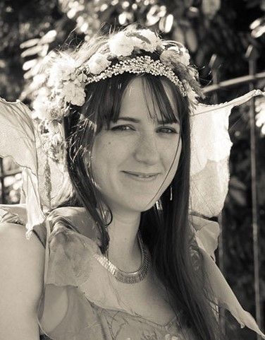

{.title-page-photo}

I’ve ended up in data science by a slightly roundabout route, but there has been a consistent thread through it: I notice when something doesn’t add up, and I want to know why. These days that habit is aimed at AI systems, specifically whether they do what we think they do, whether we can tell when they don’t, and whether we should be building them in the first place.

Before data science I spent over a decade in healthcare, local government, and retail. I trained as a nurse, ran a cash office, processed council payments, and somehow accumulated a collection of jobs that looked completely unrelated at the time. In practice, they all involved the same instinct: finding the problem, working out what was going on, and trying to make things work better.

My MSc thesis, published in the ACL Anthology, asked whether DeepSeek R1’s chain-of-thought reasoning is an honest account of what the model is doing, or just a plausible story it tells afterwards. Spoiler: mostly the latter. My BSc thesis worked out that the carbon cost of a single medical imaging ML competition was roughly equivalent to sending William Shatner to space twice. That was before generative AI made everything cost the earth. Literally.

I'm fairly sceptical about AI, although probably not in the way people expect. I use AI, but I don't think it's magic. I think it's important to understand what these systems are actually doing, where they work, where they don't, and where we probably shouldn't use them at all.

Whilst studying I was a teaching assistant at ITU Copenhagen, including on my favourite MSc course in Algorithmic Fairness, Accountability and Ethics. Mostly that meant helping students think about not just how to build a model, but when and whether to. A model trained on biased data won’t magically become unbiased. Someone has to decide what to do about that, and I’d rather more people were equipped to make that call thoughtfully.

I show people I care by making things: clothes for my kids, cookies for the office, the occasional roundhouse with friends. I nearly fell off that one, and in my defence, I didn't find out I was 20 weeks pregnant until afterwards. A lot of my work outside data science has quietly been about the same thing: making sure people are seen. I helped coordinate a community response team during the first COVID lockdown and volunteered as a peer supporter for new mothers. Noticing people and not walking past them is part of how I approach data work too; it’s just less obvious from the outside.

I have two daughters, a partner, and a habit of making things that I’ve never quite managed to train out of myself. Bread, jumpers, and occasionally projects that seemed considerably more sensible when I started them.

I passed my Danish PD3 exam in 2024, have permanent residency, and my daughters remain entirely unimpressed by my accent. They tell me I still sound *mærkeligt*, and they’re probably right.

I’m currently looking for data science and research-focused roles in the Copenhagen area.

- [View my CV](cv.qmd)
- [See my projects](projects/index.qmd)

You can also find me on [LinkedIn](https://www.linkedin.com/in/chrisanna-kate-cornish) and [GitHub](https://github.com/Xannadoo).

