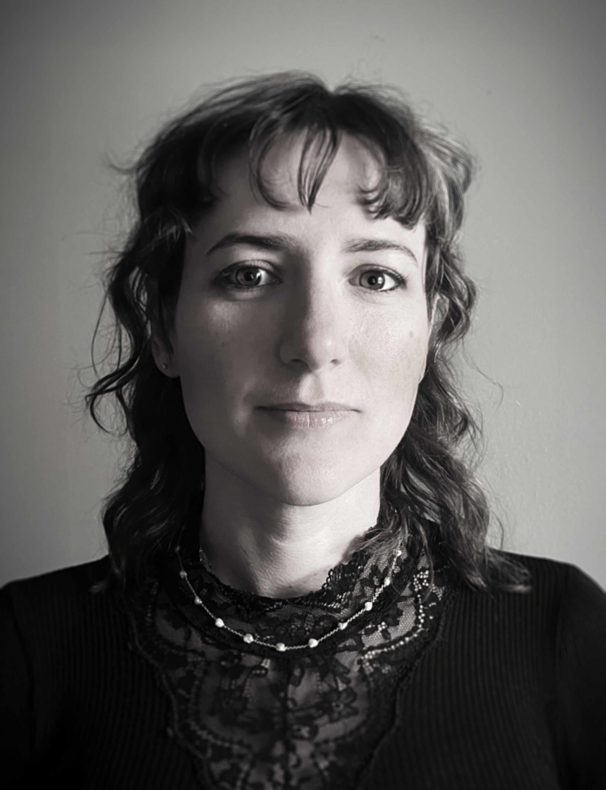

::: {.cv-header}

*Data Scientist: driven by questions, focused on clarity, fuelled by curiosity (and coffee)*

{.cv-photo}

Find me on [LinkedIn](https://www.linkedin.com/in/chrisanna-kate-cornish)

Permanent Danish residency\
Fluent English, Conversational Danish

:::

::: {.cv-jumpnav}

[Profile](#profile) · [Education](#education) · [Key Skills](#key-skills) · [Experience](#experience) · [About me](#about-me)
:::

## Profile

I have a strong instinct for finding what doesn't add up, in spreadsheets, in model outputs, in chain-of-thought reasoning, and I find it interesting rather than frustrating. My MSc thesis put that instinct to work on DeepSeek R1, and found it would change its answer in response to a hint without ever mentioning the hint in its reasoning. The model wasn't lying exactly, it just wasn't telling the whole story, which felt like familiar territory.

Most of my career, even the parts that don't look like data science on paper, has involved the same question: is this system actually doing what we think it's doing, and what happens to the person it gets wrong about? I'd like to keep asking that question somewhere it can do some good.

I work best on problems that don't have a clean answer yet, with people who'll tell me honestly when I've got something wrong. I'd rather be somewhere people disagree productively and push things forwards, than somewhere everyone nods along. I'm told I ask a lot of questions. I'd call it thoroughness.

## Education

**MSc Data Science** — ITU Copenhagen — 2023 -- 2025

*Selected courses:* Advanced Applied Statistics; Advanced Machine Learning; Advanced Robotics; Foundations of Game AI; Data Wrangling and Visualising

*Research project:* Investigating Comparison Reasoning Skills in an LLM

*Thesis:* [Examining the Faithfulness of DeepSeek R1's Chain-of-Thought Reasoning](https://aclanthology.org/2025.chomps-main.2/)\
&ensp;&ensp;<small>*Published in the ACL Anthology, IJCNLP-AACL 2025, CHOMPS workshop*</small>

**BSc Data Science** — ITU Copenhagen — 2020 -- 2023

*Thesis:* Carbon Footprint of Machine Learning Competitions with Medical Images

## Key Skills

**Technical:** Python, R, SQL, machine learning, statistical analysis, Git, Docker, Singularity, Linux, HPC/Slurm, data pipelines, data wrangling, model evaluation, visualisation

**Professional:** Teaching, technical communication, stakeholder collaboration, problem-solving, process improvement

## Experience

```{=html}
<details class="cv-entry">
  <summary><strong>Housekeeping &amp; Admin Assistant</strong> — AC Bella Sky, Copenhagen — Sept 2025 – present</summary>
  <ul>
    <li>Approved shifts for payroll, monitored housekeeper efficiency. investigating and reporting discrepancies</li>
    <li>Inspected rooms to ensure standards were met, giving feedback to housekeepers where needed</li>
    <li>Undertook housekeeping duties in a very large hotel</li>
  </ul>
</details>

<details class="cv-entry">
  <summary><strong>Teaching Assistant — BSc &amp; MSc Data Science</strong> — ITU Copenhagen — Jan 2023 – Jun 2025</summary>
  <ul>
    <li>Supported teaching across machine learning, statistics, large-scale data analysis, data wrangling, and algorithmic fairness</li>
    <li>Led tutorials, coding sessions, and project supervision for BSc and MSc students</li>
    <li>Guided model development, evaluation, and debugging using Python, Git, and ML libraries</li>
    <li>Explained core concepts including overfitting, bias, interpretability, and statistical inference</li>
  </ul>
</details>

<details class="cv-entry">
  <summary><strong>Income and Payments Assistant</strong> — East Devon District Council, UK — Nov 2018 – Aug 2020</summary>
  <ul>
    <li>Managed financial data and payment processes across departments, ensuring accuracy and compliance</li>
    <li>Improved tracking workflows and maintained documentation standards supporting transparency and collaboration</li>
  </ul>
</details>

<details class="cv-entry">
  <summary><strong>Admin / Cash Office Manager</strong> — Morrisons, Exeter, UK — Jul 2009 – Nov 2018</summary>
  <ul>
    <li>Led the cash office function in the highest-performing store in the area, which was selected as the pilot site for rollout of a new cash office system</li>
    <li>Supported system implementation across lower-performing stores during regional rollout, including on-site training and transition support</li>
    <li>Maintained high levels of accuracy and operational consistency in cash handling, reporting, and compliance</li>
    <li>Later moved to one of the supported stores as Cash Office / Admin Manager, stabilising processes and improving operational performance</li>
  </ul>
</details>

<details class="cv-entry">
  <summary><strong>Trainee Nurse</strong> — Royal Devon and Exeter Hospital, UK — Sep 2006 – Jul 2009</summary>
  <ul>
    <li>Delivered patient care and maintained accurate clinical records in a regulated healthcare environment</li>
    <li>Worked within strict governance, safety, confidentiality, and multidisciplinary care frameworks</li>
  </ul>
</details>
```

## About me

- Moved to Denmark in mid-2020 and passed PD3 in 2024. My kids say I still sound *mærkeligt*
- Student Volunteer for ALIFE Conference 2024
- Maths was my favourite subject at school, something I still get told was weird
- Enjoy building things, from Python projects to clothing and bread
- Awarded "coffee drinker of the semester" in 2024. I still have the mug