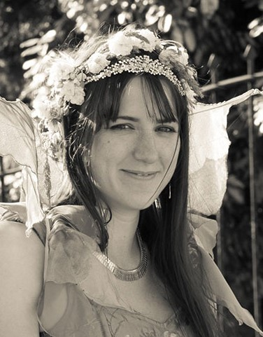

{.title-page-photo}

I trained as a nurse, ran a cash office, processed council payments, and eventually ended up in data science, which sounds like a strange route until you notice all four jobs were really the same job: finding the thing that doesn't add up and working out why. I have two daughters, a partner, and a habit of making things (bread, jumpers, occasionally a roundhouse) that I've never quite managed to train out of myself.

These days that "finding the thing that doesn't add up" habit is aimed at AI systems, specifically whether they do what we think they do, and whether we should be building them in the first place. My MSc thesis (published in the ACL Anthology) asked whether DeepSeek R1's chain-of-thought reasoning is an honest account of what the model is doing, or just a plausible story it tells afterwards. Spoiler: mostly the latter. My BSc thesis worked out that the carbon cost of a single medical imaging ML competition was roughly equivalent to sending William Shatner to space twice. That was before generative AI made everything worse.

Whilst studying I was a teaching assistant at ITU Copenhagen, including on the MSc course in Algorithmic Fairness, Accountability and Ethics. Mostly that meant helping students think about not just how to build a model, but when and whether to. A model trained on biased data won't magically be unbiased. Someone has to decide what to do about that, and I'd rather more people were equipped to make that call properly.

Before data science I spent over a decade in healthcare, local government, and retail. None of it looked like data science at the time. All of it involved the same instinct: something doesn't add up, and I want to know why.

I show people I care by making things: clothes for my kids, cookies for the office, the occasional roundhouse with friends (I nearly fell off that one, in my defence I found out shortly after I was 20 weeks pregnant at the time). A lot of my work outside data science has quietly been about the same thing, making sure people have what they need to make real choices. I helped coordinate a community response team during the first COVID lockdown, and volunteered as a peer supporter for new mothers. Noticing people and not walking past them is part of how I approach data work too, it's just less obvious from the outside.

I passed my Danish PD3 exam in 2024, have permanent residency, and my daughters remain entirely unimpressed by my accent. They tell me I still sound *mærkeligt*, and they're probably right.

I'm currently looking for data science and research-focused roles in the Copenhagen area.

- [View my CV](cv.qmd)
- [See my projects](projects/index.qmd)

You can also find me on [LinkedIn](https://www.linkedin.com/in/chrisanna-kate-cornish) and [GitHub](https://github.com/Xannadoo).

