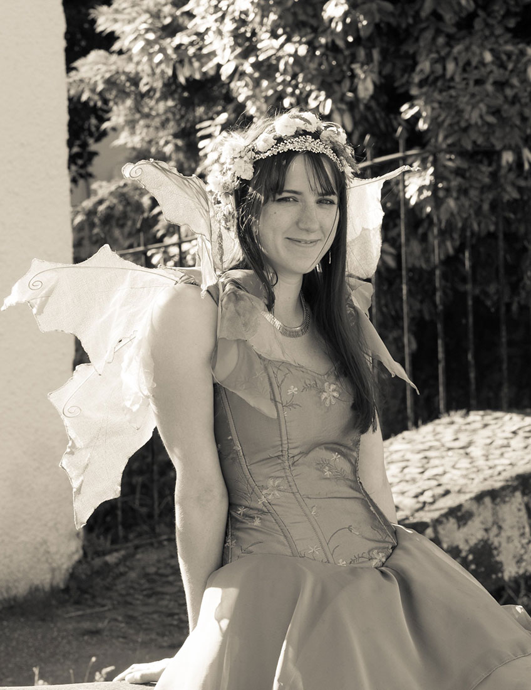

{.title-page-photo}

I care about whether the systems we build actually do what we think they do, and whether we should be building them at all.
 
My MSc thesis, published in the ACL Anthology, examined whether DeepSeek R1's chain-of-thought reasoning faithfully reflects its internal process, or whether it's largely a rationalisation after the fact. My BSc thesis found that the carbon cost of a single medical imaging ML competition was roughly equivalent to sending William Shatner to space twice. That was before generative AI.
 
Whilst studying, I was a teaching assistant at ITU Copenhagen, including on the MSc course in Algorithmic Fairness, Accountability and Ethics; helping students think critically about not just how to build models, but when and whether to. A model trained on biased data propagates that bias; deciding how to handle that should be a conscious choice. We should be making the world better, not accidentally adding to the chaos.
 
Before data science I spent over a decade in healthcare, local government, and retail. Those roles gave me a grounded sense of what systems look like from the inside, and who gets left behind when they break.
 
I show people I care by making things: clothes for my kids, cookies for the office, the occasional roundhouse with friends. A lot of my work, in different forms, has been about making sure people have what they need to make real choices; I helped coordinate one of the first community food networks during the COVID-19 lockdown, and volunteered as a peer supporter for new mothers through Sure Start. Noticing people and not walking past is part of how I approach data work too.
 
I passed my Danish PD3 exam, have permanent residency, and my kids still say I sound mærkeligt.

I'm currently looking for data science and research-focused roles in the Copenhagen area.

- [View my CV](cv.qmd)
- [See my projects](projects/index.qmd)

You can also find me on [LinkedIn](https://www.linkedin.com/in/chrisanna-kate-cornish) and [GitHub](https://github.com/Xannadoo).

